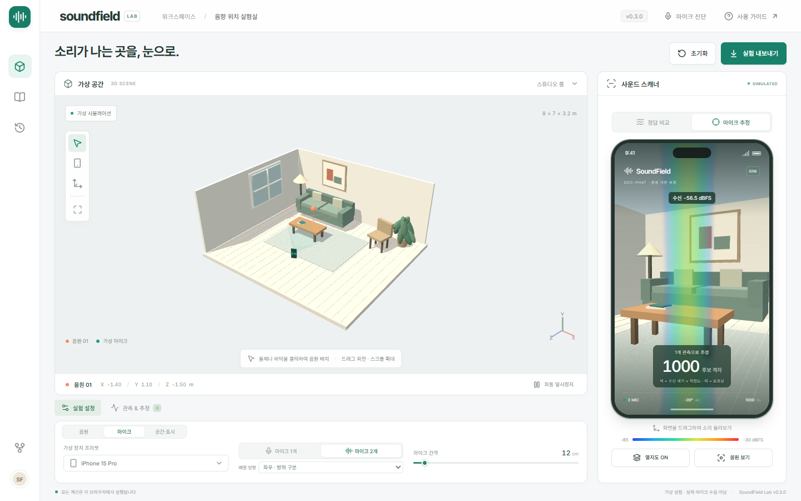

# SoundField Lab

3D 공간에서 음원을 배치하고, 가상 휴대폰 마이크로 음압 분포와 음원 위치 추정을 비교하는 한국어 웹 실험실입니다.

**현재 버전: 0.1.0. 가상 시뮬레이터이며 실제 마이크 수음은 포함하지 않습니다.**

**웹사이트: https://soundfield-lab.monosound09.workers.dev**



## 기능

- 가구가 있는 8 × 7 × 3.2 m 공간, 클릭 배치, 회전·확대, XYZ 좌표와 높이 조절
- 드래그·방향키로 보는 휴대폰 시점, 빨강–파랑 음압/위치 적합도 열지도
- 볼륨, 주파수, 파장 연동 및 정현파 미리듣기
- 마이크 1~2개, iPhone 15 Pro / iPad Pro 11″ / Galaxy S24 / 사용자 정의 가상 배열
- 마이크 간격 2~200 cm, 여러 위치·높이·방향에서 최대 12개 관측 누적
- 광대역 시간차와 단일 주파수 위상 모호성 비교, 20 cm 격자 탐색
- 버전과 가정을 포함한 실험 JSON 내보내기

## 실행

Node.js 24 이상을 사용합니다.

```sh
npm ci
npm run dev
```

http://localhost:5173 에 접속합니다. 빌드: `npm run build`. 검증: `npm run gate`, `npx playwright install chromium`, `npm run test:e2e`.

## 실험 순서

1. 왼쪽에서 물체/바닥을 클릭하고 음원 높이를 조절합니다.
2. 오른쪽을 드래그해 음압 분포를 살핍니다. 음압은 알려진 설정 위치에서 계산합니다.
3. 마이크 두 개를 선택하고 **관측 저장**을 누릅니다.
4. 왼쪽 휴대폰 도구로 장치를 옮기고, 높이와 방향을 바꾸어 관측을 더합니다.
5. 마이크 추정 화면에서 후보의 개수·범위를 확인합니다. 설정 정답과의 오차는 합성 실험 평가값입니다.

## 모델의 범위

수음 센서는 스피커가 아니라 **마이크**입니다. 한 개의 무지향성 마이크는 방향을 결정할 수 없으며 두 개의 단일 관측도 3D 좌표를 유일하게 결정하지 못합니다. 간격 증가는 조건에 따라 도움이 되지만 단일 주파수의 위상 모호성도 커질 수 있습니다. 여러 관측에는 고정 음원과 정확한 마이크 위치·동기화가 필요합니다.

자유 음장, 음속 343 m/s, 잡음 없는 합성 시간차를 사용합니다. 벽 반사·차폐·회절은 포함하지 않습니다. 기종 이름과 간격은 실험 프리셋이며 실측 하드웨어 사양이 아닙니다. 웹 브라우저가 실제 기기의 독립 마이크 채널을 제공하는지도 별도 검증이 필요합니다. 자세한 내용: [음향 모델](docs_canonical/ACOUSTICS.md).

## 배포와 문서

- [Cloudflare 배포 절차 및 상태](docs_canonical/DEPLOYMENT.md)
- [변경 이력](CHANGELOG.md) · [릴리즈](https://github.com/doroper98/sound_detection/releases)
- [요구사항과 성공 기준](GOAL.md) · [개발 로그](DEVLOG.md) · [작업 절차](WORKFLOWS.md)
- [아키텍처](docs_canonical/ARCHITECTURE.md) · [코드 규칙](docs_canonical/STYLEGUIDE.md) · [검증](docs_canonical/TESTING.md) · [파일 지도](docs_canonical/REPO_MAP.md)

사용자가 지정한 [YK_BP/docs_bp](https://github.com/doroper98/YK_BP/tree/main/docs_bp)의 요구사항 추적·CLI Gate·원자적 버전 관리·정규 문서 체계를 적용했습니다.
