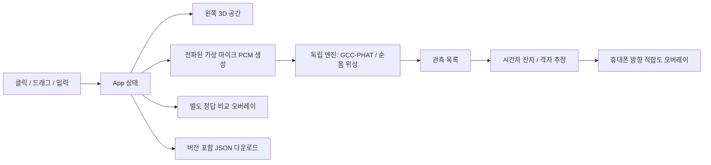

# 아키텍처

| 영역 | 선택 | 이유 |
|---|---|---|
| UI | React + TypeScript strict | 입력·관측 상태와 화면 반영 |
| 3D | Three.js, OrbitControls | 실내 geometry, raycast 배치, 가상 휴대폰 시야 |
| 음향 | 독립 TypeScript 패키지 + fft.js | PCM 기반 지연과 위치 후보, DOM 없는 빌드 |
| 열지도 | 저해상도 Canvas 2D + 시야 방향 | 배경 위 추정 방향 적합도, mesh 의존 없음 |
| 소리 출력 | Web Audio OscillatorNode | 사용자 클릭 후에만 정현파 미리듣기 |
| 빌드 | Vite, npm lockfile | 정적 배포와 재현 가능한 의존성 |
| 검증 | Vitest + Playwright | 물리 성질과 사용자 동작을 각각 검증 |
| 배포 | Cloudflare Pages (권한 대기) | 계정명 없는 HTTPS 주소, 서버·DB 불필요 |

## 데이터 흐름

## 설계 결정

- 정답 음압과 추정 적합도를 별도 모드로 분리한다. `estimate()`와 `likelihood()`에는 음원 정답 좌표를 전달하지 않는다.
- `src/simulation.ts`만 정답에서 마이크 PCM을 생성한다. `measureFrame()`에는 PCM과 마이크 배치만 제공한다. 이론 시간차로 만든 fixture는 테스트 파일에만 남아 있다. UI의 오차 비교는 검증용 정답을 사용한다.
- 원음·카메라·실제 마이크에 접근하지 않는다. 미리듣기는 출력 전용이다. 측정 신호 모델과 청각 미리듣기 신호가 같다고 주장하지 않는다.
- 3D renderer의 생명주기와 React 입력 갱신을 분리한다. ResizeObserver로 크기를 맞추고 해제 시 geometry/material/context를 정리한다.
- 전화 화면은 72×126개의 시야 광선에서 여러 거리의 적합도를 평가한다. 물체 geometry는 배경 렌더링에만 사용한다. 숨겨진 모바일 탭의 0×0 resize는 무시해 NaN camera를 방지한다.
- 추정은 20 cm 격자의 실내 후보를 평가한다. 잔차 비용으로 비교하여 확률 지수의 언더플로를 피한다. 최고 비용+3 이하 후보 개수와 최고점으로부터의 최대 거리를 보여준다.
- 수평 이동만으로 남는 고도 모호성을 줄이도록 휴대폰 높이와 시야 pitch도 변경할 수 있다.
- 모든 데이터는 메모리에만 존재한다. 새로고침하면 초기화되며 JSON 다운로드로 보관한다. JSON 가져오기는 아직 없다.
- v2 JSON에는 직렬화된 engineInput/engineOptions/searchVolume을 포함한다. SDK의 CLI replay로 화면 없이 분석할 수 있다.
- 전체 페이지는 100dvh에 맞춘다. 데스크톱은 하단 설정/관측 탭, 모바일은 공간/스캔 탭과 열린 동안에도 미리보기를 유지하는 설정 패널을 사용한다. 긴 내용은 패널 내부에서만 스크롤한다.
- 폰 프리셋은 실제 마이크 캡처 설정이 아니다. 레이아웃/예시 간격일 뿐이다.

## 보안 경계

정적 클라이언트 앱이며 서버 저장·API 호출이 없다. Cloudflare 인증은 CLI 또는 GitHub Actions secrets에만 둔다. 브라우저에는 시크릿을 제공하지 않는다. `public/_headers`에서 CSP, iframe 차단, MIME 보호, 카메라/마이크 차단을 설정한다. 가이드의 외부 링크는 GitHub 문서로만 연결된다. 폰트는 앱과 함께 배포한다.
