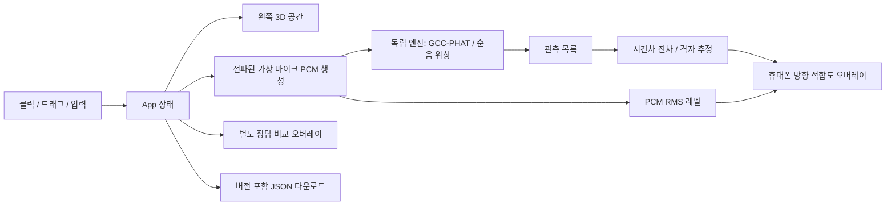

# 아키텍처

빌드 5는 `TapPipeline`의 DSP/표시 작업에 각각 최대 한 개의 처리·메인 전달만 허용한다. PCM 복사는 공유하며 별도 표시 큐에서 버퍼 내부 실제 구간을 `WaveformBatch`로 축소한다. `WaveformPlayback`은 최대 24개 축소 표시만 유지하고 기본 120ms 지연으로 묶음 도착을 흡수하며 CADisplayLink가 최대 60Hz로 표시한다. 오래 밀린 구간은 버리고 350ms 동안 새로운 오디오가 없으면 지운다. 보고서·계산은 기존 주기이며 작은 파형 뷰만 별도 관찰한다. 표시 속도는 최근 1초에 새로 선택한 PCM 창 개수이며 물리 디스플레이 refresh rate 보장이 아니다. 상세/방향 비교 시트로 가려지면 display link를 중지하고 복귀 때 최신 프레임으로 재개한다. 상세에는 마지막 보이는 동안의 fps를 유지하며 JSON에 측정 시각을 함께 남긴다.

`DirectionCalibration`은 6단계 통계 수집기다. 동일 수음 세션 안에서 하나의 폰 자세를 기준으로 사용자가 선언한 좌/정면/우를 두 번 비교한다. 3초 준비와 5초 관측 안에 완전히 포함된 분석 버퍼만 사용하며 종료 뒤 200ms 전달 여유를 둔다. 구간 길이 합·중복 시간 거부·자세 가용성·움직임·샘플률·시간차 품질을 검사한다. 중단도 최대 12개 시도에 포함해 보존한다. schemaVersion 5의 calibration에는 구간별 통계(최대 600개/시도)와 비교 결과만 포함하며 PCM·미니 파형·물리 좌표는 없다. 반복 분리 관찰도 물리 교정/위치 활성화로 승격하지 않는다.

빌드 4의 L/R 미니 파형은 분석 큐에서 현재 PCM 버퍼의 마지막 최대 10ms를 채널당 최대 96개 min/max 열로 줄여 만든다. 두 채널의 같은 구간과 공통 배율을 사용한다. `CapturedFrame`은 통계와 표시 자료를 함께 MainActor로 전달하지만, `NativeReport`에는 통계만 들어간다. 파형은 비-Codable 타입의 최신 한 묶음으로 별도 보관하며 Stop/재시작/백그라운드와 350ms 입력 지연에서 제거한다. 분석/오디오 경로 선택에 파형 자료를 역으로 사용하지 않는다.

네이티브 빌드 2의 기본 화면은 전체 화면 카메라 미리보기와 수음 오버레이다. AVCaptureSession은 영상 입력과 preview layer만 연결하고 오디오 세션 자동 설정을 끈다. 카메라 권한과 영상 세션이 준비된 뒤 AVAudioEngine 수음을 시작하며 세부 통계는 별도 시트에 표시한다. 영상·PCM 파일을 저장하지 않고 위치 표시를 만들지 않는다. 카메라 작업은 직렬 큐, 상태 갱신은 MainActor에서 처리하며 취소 토큰으로 늦은 권한/시작 완료를 무효화한다.

오디오 알림은 이유와 실제 입력 상태로 판정한다. 빌드 3은 category/config뿐 아니라 output override(사유 4)도 내장 stereo/portrait/실제 2채널·기존 샘플률을 재검사하고 엔진이 실행 중이면 유지한다. 초기 엔진 재시작은 첫 PCM 전 2초 이내·최대 2회만 허용하며 실제 장치 변경·인터럽트 시작·서비스 손실은 해제한다. 해당 엔진의 알림만 처리하고 notification 내부 스레드에서 엔진을 파괴하지 않는다. schemaVersion 4는 최근 32개 알림 종류/원인 코드/판정, 당시 입력의 항목별 검사와 분석 프레임 수, 시작 조작 경로를 기록한다. 알림 종류로 검사 실행을 생략한 뒤 false로 기록하지 않으며 기기 식별자는 포함하지 않는다.

| 영역 | 선택 | 이유 |
|---|---|---|
| UI | React + TypeScript strict | 입력·관측 상태와 화면 반영 |
| 3D | Three.js, OrbitControls | 실내 geometry, raycast 배치, 가상 휴대폰 시야 |
| 음향 | 독립 TypeScript 패키지 + fft.js | PCM 기반 지연과 위치 후보, DOM 없는 빌드 |
| 열지도 | 저해상도 Canvas 2D + 시야 방향 | 배경 위 추정 방향 적합도, mesh 의존 없음 |
| 소리 출력 | Web Audio OscillatorNode | 사용자 클릭 후에만 정현파 미리듣기 |
| 빌드 | Vite, npm lockfile | 정적 배포와 재현 가능한 의존성 |
| 검증 | Vitest + Playwright | 물리 성질과 사용자 동작을 각각 검증 |
| 배포 | Cloudflare Pages | 계정명 없는 HTTPS 주소, 서버·DB 불필요 |

## 데이터 흐름

## 설계 결정

- 연속 네이티브 진단은 `ContinuousLagTracker`로 2초/240개 통계만 보관하고 최근 0.5초 중앙값·산포를 갱신한다. 프레임별 PCM 처리는 유지하며, 위치 엔진의 관측 개수나 정확도를 임의로 늘리지 않는다. 현재 숫자와 마지막 구간 숫자를 별도로 표시한다.
- `OrientationHistory`는 Core Motion quaternion을 4초/256개만 보관한다. AVAudioTime의 host 시각을 초로 변환한 PCM 중간 시점에 ±60ms 안에서 대응하고 실제 편차를 출력한다. IMU 적분으로 이동거리를 만들거나 마이크 축을 추정하지 않는다. 센서 미지원/시각 누락은 null 대응으로 남기고 수음은 지속한다.
- CI의 unsigned IPA는 개인 서명 전 실행할 수 없는 배포 준비물이다. 플랫폼·CRC·실행 파일과 SHA-256을 검증하지만 아이폰 설치나 Enterprise/TestFlight 배포를 검증한 것은 아니다.

- iPhone 네이티브 입력은 `native/ios/`의 별도 SwiftUI 앱이다. `.record`/`.default` 세션 → 내장 front/back + stereo polar pattern + portrait 입력 방향 → 실제 2채널 검사 → AVAudioEngine tap → StereoCore 신호 진단으로 이어진다. 웹 브리지나 모노 복제는 사용하지 않는다.
- Apple 내장 스테레오의 처리 특성을 고려해 채널 지연 진단과 물리 위치 추론 사이에 교정 경계를 둔다. 기존 TypeScript 위치 엔진에 임의 센서 좌표·동기화 true를 전달하지 않는다. 앱은 좌표·카메라를 입력받지 않는다.
- 네이티브 PCM은 버퍼 한 개만 처리하고, 처리/메인 스레드 전달 중 추가 입력은 개수만 기록하여 건너뛴다. 원음 이력·녹음 파일·네트워크 호출이 없다. 통계 공유 전에도 수음을 중지한다. sampleTime 불연속은 분석 건너뛰기를 포함하며 하드웨어 동기화 측정값이 아니다.
- 앱 설정 과정의 자체 route/config 알림은 수음 중 경로 변경으로 오인하지 않도록 알림 발생 시점의 실행 토큰을 검사한다. 중지 시 토큰을 무효화하므로 늦은 권한 응답·분석 결과가 입력을 재개하지 못한다.

- v0.4.0 `/listen`: 기존 카메라 화면과 별도로 `monitorMicrophone`이 기본 오디오 입력을 연속 수집한다. 동일 채널 보존 Worklet → `analyzeChannels` / 선택한 채널의 `analyzeSpectrum` → 스펙트럼·숫자 표시. 최신 통계 하나만 유지하고 PCM 이력·녹음·오디오 재생·서버 업로드는 없다.
- `spectrum.ts`는 PCM·샘플률·대역만 받는 순수 함수다. 위치 SDK·가상 source·카메라 축을 받지 않는다. 4096개 샘플에서 평균 제거/주기 Hann/실수 FFT, 창 에너지 보정 단측 power를 계산한다. Nyquist bin은 두 배 하지 않는다.
- 연속 입력은 Stop/abort, 페이지 숨김/종료, 트랙 ended, processor error, 8초 PCM 무응답에 정리한다. getUserMedia 권한 대기는 별도이며 사용자가 취소한 뒤 늦게 허용하면 즉시 트랙을 해제한다.

- 정답 음압과 추정 적합도를 별도 모드로 분리한다. `estimate()`와 `likelihood()`에는 음원 정답 좌표를 전달하지 않는다.
- `src/simulation.ts`만 정답에서 마이크 PCM을 생성한다. `measureFrame()`에는 PCM과 마이크 배치만 제공한다. 이론 시간차로 만든 fixture는 테스트 파일에만 남아 있다. UI의 오차 비교는 검증용 정답을 사용한다.
- 시뮬레이터는 실제 입력에 접근하지 않는다. 별도 /diagnostics 화면에서 시작 버튼을 누른 경우만 실제 카메라/마이크를 연다. 미리듣기는 출력 전용이다.
- 3D renderer의 생명주기와 React 입력 갱신을 분리한다. ResizeObserver로 크기를 맞추고 해제 시 geometry/material/context를 정리한다.
- 전화 화면은 72×126개의 시야 광선에서 여러 거리의 적합도를 평가한다. 물체 geometry는 배경 렌더링에만 사용한다. 숨겨진 모바일 탭의 0×0 resize는 무시해 NaN camera를 방지한다.
- 열지도는 PCM RMS와 방향 적합도를 고정 척도로 표시한다. 볼륨 변화는 색·면적을 바꾸지만 표시 로직이 추정 지연이나 후보 탐색을 바꾸지 않는다. src/heatmap.ts는 source/scene 입력이 없다.
- 추정은 20 cm 격자의 실내 후보를 평가한다. 잔차 비용으로 비교하여 확률 지수의 언더플로를 피한다. 최고 비용+3 이하 후보 개수와 최고점으로부터의 최대 거리를 보여준다.
- 수평 이동만으로 남는 고도 모호성을 줄이도록 휴대폰 높이와 시야 pitch도 변경할 수 있다.
- 모든 데이터는 메모리에만 존재한다. 새로고침하면 초기화되며 JSON 다운로드로 보관한다. JSON 가져오기는 아직 없다.
- v2 JSON에는 직렬화된 engineInput/engineOptions/searchVolume을 포함한다. SDK의 CLI replay로 화면 없이 분석할 수 있다.
- 전체 페이지는 100dvh에 맞춘다. 데스크톱은 하단 설정/관측 탭, 모바일은 공간/스캔 탭과 열린 동안에도 미리보기를 유지하는 설정 패널을 사용한다. 긴 내용은 패널 내부에서만 스크롤한다.
- 폰 프리셋은 실제 마이크 캡처 설정이 아니다. 레이아웃/예시 간격일 뿐이다.
- 시뮬레이터와 실제 진단은 경로별 lazy chunk로 분리한다. 진단은 source/scene/DSP 엔진을 import하지 않으며 실제 영상에 임의 위치 열지도를 만들지 않는다.
- 진단 흐름은 getUserMedia → MediaStreamAudioSourceNode → AudioWorklet(입력 채널 수 유지) → 채널 RMS/차이/상관 통계다. Web Audio 연결 전 브라우저가 혼합·복제할 수 있어 getSettings, getCapabilities와 PCM 수를 별개로 기록한다. 4채널로 강제 upmix하지 않는다. 출력은 항상 무음이다.
- 취소 후 늦게 도착한 권한 응답도 track.stop() 처리한다. 검사별 스트림과 AudioContext를 정리하며 페이지 숨김/종료 시 모든 캡처를 해제한다. 다운로드에는 원음·영상·deviceId·groupId를 포함하지 않는다.
- 설정은 데스크톱 112px, 모바일 174px로 줄이고 세부 항목을 탭으로 선택한다. 관측 패널은 펼쳤을 때만 별도 높이를 사용한다.

## 보안 경계

정적 클라이언트 앱이며 서버 저장·API 호출이 없다. Cloudflare 인증은 CLI 또는 GitHub Actions secrets에만 둔다. 브라우저에는 시크릿을 제공하지 않는다. `public/_headers`에서 CSP, iframe 차단, MIME 보호, 동일 origin의 카메라/마이크만 허용한다. 실제 브라우저 권한 동의가 별도로 필요하다. 폰트와 Worklet은 앱과 같은 사이트에서 제공한다.
